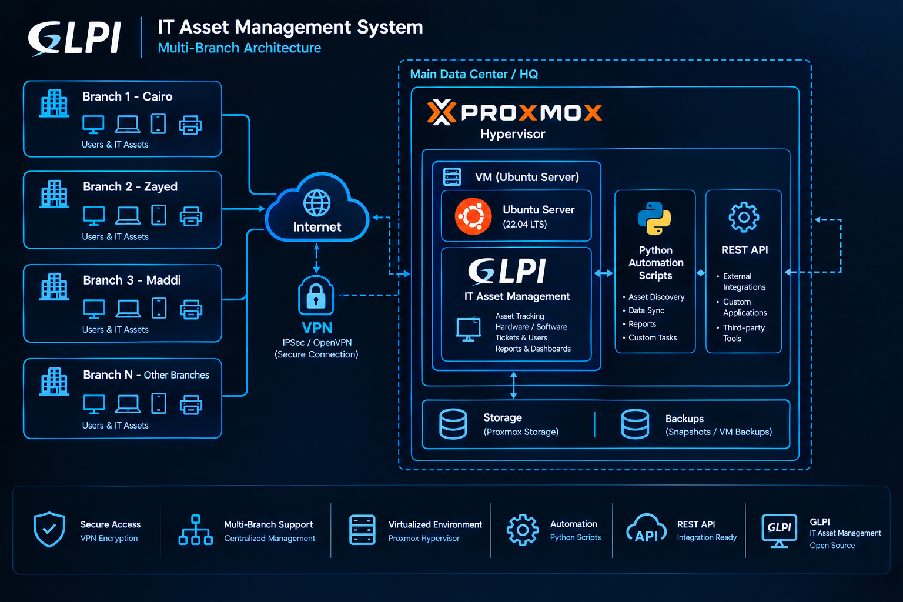

# 🖥️ GLPI IT Asset Management — Full Deployment

> End-to-end IT Asset Management implementation for a fast-growing PropTech company in Egypt, covering multiple office locations across Cairo.

---
## 📸 Screenshots


---

## 📋 Table of Contents

- [Project Overview](#project-overview)
- [Infrastructure Setup](#infrastructure-setup)
- [System Architecture](#system-architecture)
- [GLPI Configuration](#glpi-configuration)
- [API Automation](#api-automation)
- [Results](#results)
- [Tech Stack](#tech-stack)
- [Key Learnings](#key-learnings)

---

## Project Overview

Deployed and fully configured **GLPI** (Gestionnaire Libre de Parc Informatique) as a centralized IT Asset Management System from scratch for NAWY — one of Egypt's leading PropTech companies.

**Scope:**
- Track all company laptops across multiple office locations
- Onboard the entire workforce into the system
- Automate asset-user assignment and lifecycle management
- Establish a repeatable weekly sync process using Python REST API

---

## Infrastructure Setup

### Virtualization
- Deployed GLPI on **Ubuntu Server 24.04 LTS** hosted as a VM on **Proxmox VE**
- Configured VM auto-start on host boot to ensure availability after power outages

### Network Access
- Configured VPN policies to allow access 
  across multiple office branches
- Enabled **GLPI REST API** (Legacy mode) for programmatic access

### Server Stack
```
Proxmox Hypervisor
└── Ubuntu Server 24.04 VM
    ├── Apache2
    ├── PHP 8.x
    ├── MySQL / MariaDB
    └── GLPI 10.x
```

---

## System Architecture

```
┌─────────────────────────────────────────────────────┐
│                  NAWY Office Network                │
│                                                     │
│  Branch 1 ──┐                                       │
│  Branch 2 ──┤                                       │
│  Branch 3 ──┤── VPN ── GLPI VM (Proxmox)            │
│  Branch 4 ──┤                                       │
│  Branch 5 ──┘                                       │
└─────────────────────────────────────────────────────┘
```

---

## GLPI Configuration

### Role-Based Access Control (RBAC)

| Profile | Users | Permissions |
|---------|-------|-------------|
| **Super-Admin** | IT Management Team | Full system access |
| **Technical** | IT Support Team | Assets + Users CRUD |
| **Self-Service** | All Employees | Create tickets, view own device |

### Asset Status Lifecycle

```
Stock → In Use → Stock (return)
              ↘ Pending (maintenance)
              ↘ Retired (end of life)
```

---

## API Automation

Built Python scripts using GLPI REST API to automate repetitive IT tasks:

### Scripts

| Script | Description |
|--------|-------------|
| `weekly_sync.py` | Detects new hires, serial changes, and inactive users |
| `add_emails.py` | Assigns email addresses to users based on username pattern |
| `deactivate_users.py` | Deactivates offboarded users (IT team excluded) |

### Weekly Sync Workflow

```
Every Week:
1. Fetch all users from GLPI
2. Compare with Active Directory
3. Detect new hires → flag for onboarding
4. Detect serial changes → update records
5. Detect inactive users → deactivate accounts
6. Generate report
```

### IT Team Protection

The scripts include a safelist of IT team members who are
never deactivated, regardless of AD status:

```python
IT_TEAM = [
    "ayman.ahmed", ...
]
```

---

## Results

| Metric | Value |
|--------|-------|
| Total Users Managed | 1,500+ |
| Total Devices Tracked | 2,700+ |
| Office Locations | Multiple branches across Cairo |
| Weekly Sync | Automated via Python REST API |
| Time Saved | Several hours of manual work per week |

---

## Tech Stack

| Technology | Role |
|------------|------|
| GLPI 10.x | IT Asset Management Platform |
| Ubuntu Server 24.04 | Host OS |
| Proxmox VE | Hypervisor |
| Apache2 + PHP 8.x | Web Server |
| MySQL / MariaDB | Database |
| Python 3.x | Automation Scripts |
| FortiGate | Network + VPN |
| GLPI REST API | Programmatic Access |

---

## Key Learnings

1. **REST API authentication** — GLPI uses dual-token auth (App-Token + Session-Token). Session must be initialized before every request and killed after.

2. **Bulk operations** — Always use `range=0-5000` to avoid pagination issues when fetching large datasets.

3. **IT team protection** — Always safelist IT accounts before running any deactivation script in production.

4. **Proxmox auto-start** — Critical for GLPI availability. Without it, the VM doesn't start after power outages.

5. **FortiGate VPN** — Required for cross-branch access. Phase 2 selectors must include the GLPI server subnet.

---

## Repository Structure

```
glpi-asset-management/
├── scripts/
│   ├── weekly_sync.py      # Main sync script
│   ├── add_emails.py       # Email assignment
│   └── deactivate_users.py # User deactivation
├── docs/
│   └── api-reference.md    # GLPI API notes
└── README.md
```

---

## 👤 Author

**Ayman Ahmed** — IT Specialist | Network Security
[](https://github.com/AymanAhmedAli)
[](https://www.linkedin.com/in/aymanahmedali/)
